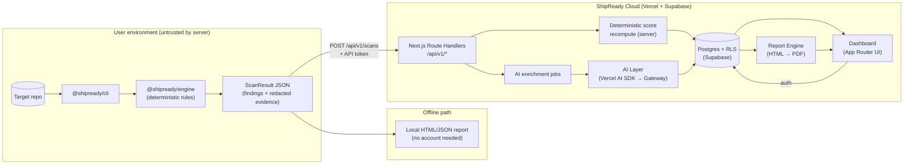
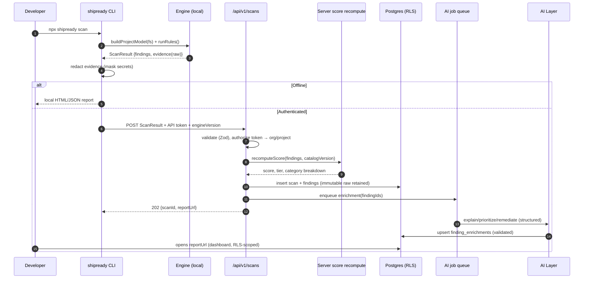
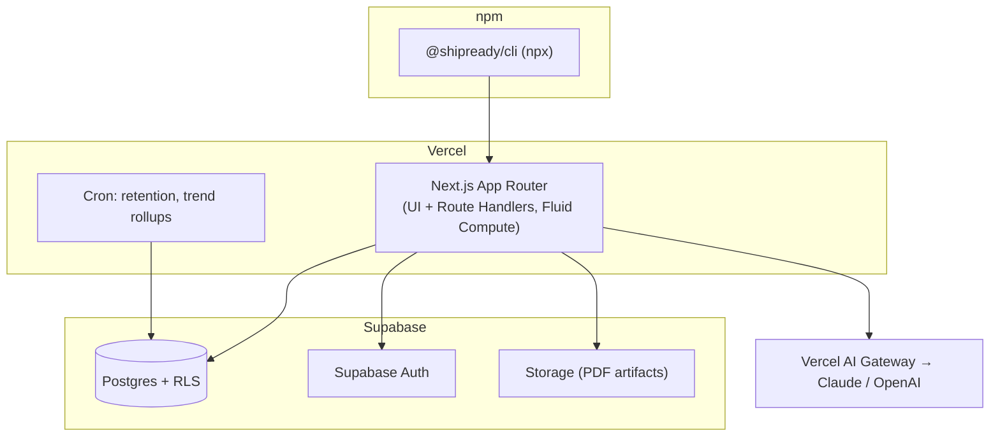

# ARCHITECTURE.md — ShipReady AI

> **Status note (post-lock):** The "own pure-TS deterministic engine" described below is **superseded by
> ADR-001 and `PROVIDER_ARCHITECTURE.md`.** ShipReady no longer builds a general analysis engine: analyzers
> (Semgrep, CodeQL, ESLint, Trivy, `tsc`, native RLS/SQL) are **interchangeable providers**, and the "engine"
> is now the **provider-agnostic normalization → policy → report core** over a canonical Finding model. The
> data-flow, subsystem boundaries, trust boundary, and deployment topology in this document remain valid;
> read "the engine" as "the provider-blind core," and see `PROVIDER_ARCHITECTURE.md` for the authoritative
> analyzer/normalization/policy design.

## 1. Architectural thesis

Three properties drive every decision:

1. **The engine is a pure, offline, deterministic library.** It takes a filesystem and configuration
   in; it emits a `ScanResult` out. No network, no clock-dependence, no randomness, no LLM. This makes
   it exhaustively unit-testable and independently trustworthy.
2. **Analysis runs where the code lives (the user's machine).** The hosted platform never receives
   source code — only the structured `ScanResult` with redacted evidence.
3. **The server treats the client as untrusted.** Everything that affects the *verdict* (the score,
   the severity math) is recomputed server-side from the submitted findings against a versioned rule
   catalog. The client cannot manufacture a passing grade.

Everything else — the dashboard, the AI explanations, PDF export, billing — is a conventional
Next-on-Vercel + Supabase app layered on top of that engine.

## 2. System overview

## 3. Subsystems and responsibilities

| Subsystem | Package / location | Responsibility | Explicitly NOT responsible for |
|---|---|---|---|
| **Schema** | `@shipready/schema` | Zod schemas + inferred TS types for `ScanResult`, `Finding`, `Evidence`, `Report`, API DTOs. Rule catalog metadata. Single source of truth shared by CLI and web. | Business logic, IO |
| **Engine** | `@shipready/engine` | The deterministic audit: rule registry, scanners, evidence collection, confidence, severity, local scoring. Pure functions. | Network, LLM, persistence, redaction policy decisions (it *marks* secrets; CLI redacts) |
| **File scanner** | `@shipready/engine/scanner` | Filesystem discovery, `.gitignore`-aware walking, framework detection, AST parsing (TS compiler API), SQL/migration parsing, config + lockfile parsing. Provides a normalized `ProjectModel` to rules. | Deciding findings (that's rules) |
| **CLI** | `@shipready/cli` | Orchestrates a scan, redacts evidence, renders local reports, authenticates, uploads. Runs the user's own `tsc` for the compile check. | Any rule logic (delegates to engine) |
| **Web API** | `apps/web/app/api/v1/*` | Ingest scans, recompute score, enqueue AI jobs, serve reports, manage orgs/projects/tokens, webhooks. | Running the engine on source (never has source) |
| **AI layer** | `apps/web/lib/ai/*` | Explanations, remediation drafts, prioritization narrative, executive summary. Structured outputs validated against Zod. | Determining whether a finding exists; changing scores |
| **Report engine** | `apps/web/lib/report/*` | Compose HTML report from findings + AI text; render to PDF; charts. | Fact generation |
| **Dashboard** | `apps/web/app/(dashboard)/*` | Projects, scan history, finding triage, trends, sharing, billing. | — |
| **Persistence** | Supabase (Postgres + RLS + Storage) | Tenanted data, report artifacts. | — |

## 4. Data model at a glance (see DATABASE.md for full schema)

- `organizations` → `memberships` → `users`
- `organizations` → `api_tokens`
- `organizations` → `projects` → `scans` → `findings`
- `scans` hold the raw submitted `ScanResult` (jsonb, immutable) **and** the server-recomputed score.
- `findings` are the normalized, queryable rows; each references a `rule_id` from the versioned catalog.
- `finding_enrichments` hold AI-generated explanation/remediation, linked to a finding + model version.

## 5. Core data flow — a scan, end to end

**Why score recompute lives server-side:** the CLI is attacker-controllable. The engine also computes a
score locally (for the offline report), but the *authoritative* score shown in the dashboard, used for
badges, and stored for trends is always the server's recomputation from the findings against the
pinned catalog version. If the client's local score and the server's disagree, the server's wins and
the delta is logged (a signal of tampering or version skew).

## 6. Boundaries and contracts

- **Engine ⇄ everything:** the only contract is `@shipready/schema`. The engine imports nothing from the
  web app. The web app imports engine types, never engine runtime, on source (it has no source to run).
- **CLI ⇄ API:** versioned REST (`/api/v1`), `engineVersion` + `catalogVersion` sent on every scan so
  the server can reconcile. Backward-compatible ingestion; the server can score older engine outputs.
- **AI ⇄ findings:** AI receives a *finding and its evidence*, and returns text fields only. It is
  structurally impossible for the AI layer to add, remove, or reclassify a finding — the DTO it returns
  has no severity/existence fields. (See AI_LAYER.md.)
- **Trust boundary line:** everything inside the user environment is untrusted input to the cloud.
  Everything crossing `/api/v1` is validated with Zod and authorized against RLS-backed ownership.

## 7. Deployment topology

- **CLI:** published to npm, runs anywhere Node runs (dev machine, CI runner). No server component.
- **Web:** single Next.js app on Vercel (Fluid Compute, Node runtime — streaming for AI is fine on
  Node, no Edge needed). Route Handlers are the API. Cron for retention + trend rollups.
- **Data:** Supabase Postgres (RLS-enforced multi-tenancy), Supabase Auth, Supabase Storage for
  generated PDFs.
- **AI:** via Vercel AI Gateway using `"provider/model"` routing, so provider failover and cost
  tracking are centralized (see AI_LAYER.md).

## 8. Why this beats the "hosted sandbox" alternative

| Concern | CLI-first (chosen) | Hosted sandbox (rejected for V1) |
|---|---|---|
| Untrusted code execution | None on our infra | Must contain hostile repos in microVMs |
| Source custody | We never hold it | We hold customer source (legal + breach risk) |
| Accuracy of toolchain checks | Uses the user's real `tsc`, lockfile, resolution | Must reconstruct env, often wrong |
| Infra cost | ~zero for scanning | Per-scan compute + isolation overhead |
| CI integration | Native (`npx` in a step) | Requires connecting repos to us |
| Time to ship | Fast | Slow (sandbox hardening is the whole project) |

Trade-off we accept: we can't scan a repo the user hasn't checked out, and the client is untrustworthy —
both mitigated by the GitHub App (Phase 2, still read-only) and server-side score recompute + attestation.

## 9. Failure modes and degradation

- **AI provider down:** findings, scores, and reports still render. Enrichment fields show "explanation
  pending" and retry via the queue. The verdict never depends on AI availability.
- **Engine crash on a weird file:** rules are sandboxed per-rule; one rule throwing is recorded as a
  `ruleError` (surfaced as "could not evaluate", never as a pass). A scan is never silently incomplete.
- **Upload failure:** CLI writes the local report regardless, and can `shipready push <result.json>`
  later.
- **Schema/version skew:** server ingests older engine outputs; unknown rule IDs are stored and scored
  as "unweighted/unknown" rather than dropped.
