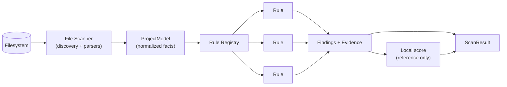

# AUDIT_ENGINE.md — ShipReady AI

> **Status note (post-lock):** This document's "rules are our own pure-TS functions over a ProjectModel"
> model is **reframed by ADR-001 and `PROVIDER_ARCHITECTURE.md`.** Detection is now performed by
> **providers** (wrapped external analyzers + a small set of ShipReady **native semantic providers** for
> RLS/SQL, dependencies, config). What ShipReady still owns — and what remains authoritative here — is the
> **canonical catalog**: rule IDs, categories, severity, confidence, evidence contract, false-positive
> discipline, and extensibility. Two clarifications override the body below:
> (1) **canonical severity/confidence are assigned by the catalog's predicate→assignment mapping**
> (`PROVIDER_ARCHITECTURE.md` §1.2), not by rule code or by the provider;
> (2) **corroboration raises confidence, but base severity gates** (§4.9). Treat the "rules" here as the
> **curated canonical catalog + native-provider checks**, not a bespoke engine.

The engine is the product. Everything else is packaging. It is a **pure, deterministic** library:
`ProjectModel` in → `ScanResult` out. No network, no LLM, no randomness, no wall-clock in the verdict.

## 1. Anatomy



- **Scanner** builds a `ProjectModel`: file tree, parsed ASTs, parsed SQL/migrations, parsed configs,
  dependency graph, detected frameworks. (See FILE_SCANNER.md.) Rules never touch the raw filesystem —
  they read the model. This keeps rules fast, pure, and independently testable.
- **Rule Registry** holds every rule as a self-describing object.
- Each rule returns zero or more `Finding`s, each with `Evidence`.
- **Local scoring** runs for the offline report; the *authoritative* score is the server recompute
  (SCORING.md).

## 2. The Rule contract

```ts
interface Rule {
  id: RuleId;                       // "SR-RLS-001"
  category: Category;               // "database" | "auth" | ...
  title: string;                    // short, imperative: "Enable RLS on public tables"
  defaultSeverity: Severity;        // may be downgraded/upgraded by the rule per-finding
  weight: number;                   // catalog weight (SCORING.md)
  appliesTo(model: ProjectModel): boolean;   // fast gate; e.g. only if Supabase detected
  evaluate(model: ProjectModel): RuleResult; // pure; must not throw for "not found" — returns []
  docsUrl: string;                  // stable link to the rule's explanation page
  cwe?: string[];                   // e.g. ["CWE-284"] for mapping/reporting
}

interface RuleResult {
  findings: Finding[];
  // A rule MAY report it could not fully evaluate (e.g. unparseable file):
  inconclusive?: { reason: string; file?: string }[];
}

interface Finding {
  ruleId: RuleId;
  severity: Severity;               // final, per-finding
  confidence: Confidence;           // certain | firm | tentative
  location: { file: string; lineStart?: number; lineEnd?: number };
  evidence: Evidence;
  fingerprint: string;              // stable hash for dedupe/trend (engine-computed)
  message: string;                  // one-line, specific, no fluff
}

interface Evidence {
  snippet?: string;                 // minimal surrounding code (redaction applied by CLI)
  matched?: string;                 // the exact token/pattern (masked if secret)
  facts: Record<string, string | number | boolean>; // structured, e.g. { table: "profiles", rlsEnabled: false }
}
```

**Hard rules for rule authors:**
- **Deterministic.** Same `ProjectModel` ⇒ identical findings + order (sort by `file, lineStart, ruleId`).
- **Never throws for absence.** "Not found" is `[]`, not an exception. Unparseable input →
  `inconclusive`, surfaced as "could not evaluate", never as a pass.
- **Evidence or it didn't happen.** Every finding carries `location` + `Evidence.facts`. A rule that
  can't cite evidence must not emit a finding — it emits `inconclusive`.
- **No cross-rule state.** Rules are independent and individually testable.
- **Isolated failure.** The registry runs each rule in a try/catch; a thrown rule becomes a `ruleError`
  entry in the `ScanResult` (visible), never a dropped or silently-passed check.

## 3. Categories

| Category | Prefix | Focus |
|---|---|---|
| Security | `SEC` | Secrets, dangerous sinks, unsafe config, XSS/SSRF-prone patterns |
| Authentication | `AUTH` | Session handling, auth enforcement on routes/actions |
| Authorization | `AUTHZ` | Object-level authz, "authenticated ≠ authorized" |
| Database / Supabase | `RLS`, `DB`, `SUP` | RLS presence & quality, migrations, indexes, service-key misuse |
| API routes | `API` | Validation, error verbosity, method safety, rate limiting |
| Dependencies | `DEP` | Bloat, known-bad packages, postinstall scripts, duplication |
| TypeScript | `TS` | Strictness, `any` at boundaries, compile status |
| Accessibility | `A11Y` | Baseline WCAG-detectable-statically issues |
| Performance | `PERF` | Obvious regressions (unbounded queries, no pagination, huge client bundles) |
| Architecture | `ARCH` | Duplication, layering violations, dead code, maintainability |
| Configuration | `CFG` | Env handling, framework config, headers, build settings |

Rule ID format: **`SR-<PREFIX>-<NNN>`**, e.g. `SR-RLS-001`, `SR-AUTHZ-004`. IDs are permanent; a
retired rule's ID is never reused (its catalog entry gets `status: deprecated`).

## 4. Representative rules (illustrative, not exhaustive — full catalog is data)

| Rule ID | Title | Detection (static) | Severity | Confidence |
|---|---|---|---|---|
| `SR-RLS-001` | Table created without RLS enabled | Parse migrations; `CREATE TABLE` in a `public` schema with no matching `ENABLE ROW LEVEL SECURITY` | Critical | Certain |
| `SR-RLS-002` | RLS enabled but policy is permissive | Policy body resolves to `USING (true)` / `WITH CHECK (true)` | High | Firm |
| `SR-RLS-003` | RLS enabled, no policies defined (table fully locked *or* relying on service key) | `ENABLE RLS` present, zero `CREATE POLICY` for table | Medium | Firm |
| `SR-SUP-001` | Service-role key referenced in client-reachable code | `SUPABASE_SERVICE_ROLE_KEY` used outside server-only files; or `service_role` client in a component | Critical | Certain |
| `SR-SEC-001` | Secret committed to the repo | Entropy + known-pattern scan of tracked files, `.env` tracked by git | Critical | Certain/Firm |
| `SR-SEC-002` | Secret exposed via `NEXT_PUBLIC_` prefix | Env var with `NEXT_PUBLIC_` whose name/value matches secret patterns | Critical | Firm |
| `SR-AUTH-001` | Route handler performs sensitive action without auth check | AST: mutating handler with no session/user retrieval on the path | High | Firm |
| `SR-AUTHZ-001` | Authenticated but not authorized (no ownership check) | Mutation resolves a record by id from params without an `org_id`/owner check | High | Tentative→Firm |
| `SR-API-001` | Request body used without schema validation | Handler reads `req.json()`/`params` and passes to DB/logic without Zod/validator | High | Firm |
| `SR-API-002` | Verbose error leaks internals | `catch` returns `error.message`/stack to client | Medium | Firm |
| `SR-DB-001` | Foreign key without covering index | Schema: FK column not present in any index | Medium | Firm |
| `SR-DB-002` | Destructive migration without expand/contract | `DROP COLUMN`/`DROP TABLE`/type-narrowing in a migration | High | Firm |
| `SR-DEP-001` | `postinstall` script in a dependency | Lockfile/package metadata scan | Medium | Certain |
| `SR-DEP-002` | Dependency bloat / duplicate major versions | Multiple majors of same package in lockfile | Low | Certain |
| `SR-TS-001` | TypeScript not strict | `tsconfig` `strict !== true` | Medium | Certain |
| `SR-TS-002` | Project does not compile | Ran the user's `tsc --noEmit`; non-zero exit | High | Certain |
| `SR-TS-003` | `any` at a trust boundary | Route/handler params typed `any`/`unknown`-unchecked | Low | Tentative |
| `SR-A11Y-001` | Image without alt / control without label | JSX AST: `` no `alt`, interactive element no accessible name | Low | Firm |
| `SR-PERF-001` | Unbounded DB query (no limit/pagination) | Supabase/SQL select without `.limit()`/`LIMIT` in a list path | Low | Tentative |
| `SR-CFG-001` | Missing security headers config | No CSP/HSTS/frame options in Next config/middleware | Low | Firm |
| `SR-ARCH-001` | Duplicated component/module | Structural similarity above threshold across files | Low | Tentative |

Every catalog entry also carries `cwe`, `docsUrl`, remediation template id, and weight. The catalog is
seeded into `rules_catalog` (DATABASE.md) so the server can score and reconcile independently.

## 5. Confidence

Three levels, and they are **first-class**, not cosmetic:

| Confidence | Meaning | Effect |
|---|---|---|
| **Certain** | Deterministic fact, no interpretation (secret committed, RLS `ENABLE` absent) | Full scoring weight; shown by default |
| **Firm** | Strong static signal with a well-understood, small false-positive surface | Full weight; shown by default |
| **Tentative** | Heuristic; plausible false positives (e.g. ownership-check inference) | **Reduced scoring weight** and grouped under "Worth reviewing"; never blocks a "Ready" verdict on its own |

Confidence is chosen by the rule author per rule (and can vary per finding). It drives both scoring
(SCORING.md) and UI grouping (UI_SYSTEM.md). **We would rather under-claim than fabricate** — the
product dies the first time a Critical is wrong.

## 6. Severity

`critical > high > medium > low > info`. Severity answers "how bad if true"; confidence answers "how
sure it's true." They are orthogonal and both stored. Guidance:

- **Critical:** direct data exposure or account takeover if shipped (missing RLS, committed secret,
  service key in client). A single open Critical caps the readiness tier at "Blocked" (SCORING.md).
- **High:** likely exploitable authz/validation gap or a compile failure.
- **Medium:** meaningful risk or maintainability debt.
- **Low / Info:** polish, best-practice, or advisory.

Default severity comes from the catalog; a rule may adjust per finding with a recorded reason (e.g.
committed secret that is a `test`-prefixed key → downgrade with `facts.reason`).

## 7. Evidence collection

- Evidence is **minimal and sufficient**: the fewest lines needed to make the finding self-evident,
  plus structured `facts`.
- **Secrets are marked by the engine and masked by the CLI** before upload: the engine sets
  `evidence.matched` with a `secret: true` flag; the CLI replaces the value with `sr_masked(len,hint)`
  and truncates the snippet. Raw secret values never enter a `ScanResult` that leaves the machine.
- `facts` are structured so the report and AI layer can template without re-parsing code (e.g.
  `{ table: "profiles", schema: "public", rlsEnabled: false, migrationFile: "0003_init.sql" }`).
- Line numbers come from the AST/parse position, guaranteeing they point at real source.

## 8. False-positive handling

1. **Confidence downgrade** rather than suppression: heuristic rules ship as `tentative` and are
   quarantined from the blocking verdict.
2. **Per-finding suppression** via inline comment (`// shipready-disable-next-line SR-AUTHZ-001 --
   reason`) — recorded in the finding as `suppressed: true` with the reason, still visible in the report
   (transparency), excluded from score. Suppressions themselves are a report section (a scan can be
   "clean but heavily suppressed").
3. **Config-level ignores** (`shipready.config.ts`): ignore paths (generated code, vendored dirs) and
   rules, again recorded and shown, never silent.
4. **False-positive reporting loop:** the dashboard lets a user mark a finding `false_positive`; these
   feed rule-quality telemetry (which rule, what evidence) to tighten heuristics. Precision per rule is
   a tracked metric (PROJECT.md §6).
5. **Golden-repo test corpus:** a set of fixture repos (known-good and known-bad) that every rule is
   tested against; a rule change that regresses the corpus fails CI. This is how we keep precision high.

## 9. Extensibility

- **Adding a rule = adding a data-plus-function module** in `@shipready/engine/rules/<category>/` that
  exports a `Rule`, registering it in the category index, adding catalog metadata + a docs page + golden
  fixtures. No engine-core change. New rule IDs are additive → catalog **minor** bump.
- **Rule packs / plugins (Phase 3):** rules are already isolated and self-describing, so a signed
  external rule pack is a natural extension. Not in V1 (trust + sandboxing implications).
- **Framework awareness:** `appliesTo` + `ProjectModel.frameworks` let rules target stacks (Next.js,
  Supabase) without polluting unrelated projects.
- **Versioning:** reweighting or removing a rule is a **major** catalog bump (changes historical
  comparability); the server records `catalog_version` per scan so old scores stay reproducible.

## 10. What the engine deliberately does NOT do

- It does not call an LLM. Ever. (AI is a separate, later, server-side layer.)
- It does not execute the target application.
- It does not decide the authoritative score (server does).
- It does not redact (it *marks*; the CLI redacts) — separation keeps the engine pure and testable and
  the redaction policy in one place near the network boundary.
