# DATABASE.md — ShipReady AI

Postgres (Supabase). Multi-tenant by **organization**. RLS is mandatory on every table holding tenant
data — both because it is our security model and because we audit for its absence, so we must be
exemplary. Schema managed as code with **Drizzle**; RLS policies live in dedicated, reviewed migrations.

## 1. Design principles

1. **Every tenant table has `org_id` and an RLS policy.** No exceptions. A table without RLS is a bug we
   would flag in a customer's repo.
2. **Scans are immutable.** The raw submitted `ScanResult` is stored verbatim (jsonb) and never mutated.
   Corrections happen by adding a new scan, not editing history — this is an audit product.
3. **Findings are normalized rows** for querying/trends; the raw result remains the source of truth.
4. **Score is stored, but derived.** We persist the server-recomputed score for speed and history, and
   store the `catalog_version` used so any historical score is reproducible.
5. **AI output is segregated** into `finding_enrichments`, versioned by model + prompt, never inline in
   the finding (keeps the deterministic core clean and the AI output disposable/regenerable).
6. **Least privilege:** the app connects with the RLS-enforced anon/auth role. Only narrow, audited
   server tasks (score recompute already happens in the request; ingestion) use elevated access, and
   even those set `org_id` explicitly.

## 2. Entity relationship diagram

```mermaid
erDiagram
    organizations ||--o{ memberships : has
    users ||--o{ memberships : in
    organizations ||--o{ api_tokens : issues
    organizations ||--o{ projects : owns
    projects ||--o{ scans : has
    scans ||--o{ findings : produces
    findings ||--o| finding_enrichments : explained_by
    scans ||--o| reports : renders
    organizations ||--o{ audit_log : records
    rules_catalog ||--o{ findings : classifies

    organizations {
      uuid id PK
      text name
      text slug UK
      text plan
      timestamptz created_at
    }
    users {
      uuid id PK "= auth.users.id"
      text email
      timestamptz created_at
    }
    memberships {
      uuid id PK
      uuid org_id FK
      uuid user_id FK
      text role "owner|admin|member|viewer"
      timestamptz created_at
    }
    api_tokens {
      uuid id PK
      uuid org_id FK
      text name
      text token_hash "sha256, never plaintext"
      text token_prefix "for display: sr_live_ab12…"
      uuid created_by FK
      timestamptz last_used_at
      timestamptz revoked_at
      timestamptz created_at
    }
    projects {
      uuid id PK
      uuid org_id FK
      text name
      text repo_identity "hashed repo fingerprint, optional"
      timestamptz created_at
    }
    scans {
      uuid id PK
      uuid org_id FK
      uuid project_id FK
      uuid created_by "user or token id"
      text engine_version
      text catalog_version
      jsonb raw_result "immutable ScanResult"
      int score "server-recomputed 0-100"
      text tier "ready|at_risk|blocked"
      jsonb score_breakdown "per-category"
      int finding_count
      timestamptz scanned_at "from client"
      timestamptz created_at "server receipt"
    }
    findings {
      uuid id PK
      uuid org_id FK
      uuid scan_id FK
      text rule_id FK
      text severity "critical|high|medium|low|info"
      text confidence "certain|firm|tentative"
      text status "open|acknowledged|fixed|wontfix|false_positive"
      text file_path
      int line_start
      int line_end
      jsonb evidence "redacted snippet + metadata"
      text fingerprint "stable id for dedupe/trend"
      timestamptz created_at
    }
    finding_enrichments {
      uuid id PK
      uuid org_id FK
      uuid finding_id FK
      text model
      text prompt_version
      text explanation
      text remediation
      text priority_rationale
      timestamptz created_at
    }
    reports {
      uuid id PK
      uuid org_id FK
      uuid scan_id FK
      text format "html|pdf"
      text storage_path
      text share_slug UK "nullable, for public share"
      timestamptz expires_at
      timestamptz created_at
    }
    rules_catalog {
      text rule_id PK "SR-RLS-001"
      text version
      text category
      text default_severity
      numeric weight
      text title
      jsonb metadata
    }
    audit_log {
      uuid id PK
      uuid org_id FK
      uuid actor_id
      text action
      jsonb context
      timestamptz created_at
    }
```



## 3. Table specifications

### `organizations`
Tenant root. `slug` unique, URL-safe. `plan` enum (`free|pro|team|enterprise`). A personal account is
just an org with one owner (simplifies the model — no separate "personal" path).

### `users`
Mirror of `auth.users` (Supabase Auth owns identity). We store only `id` + `email` for joins/display.
Never store passwords (Supabase Auth does).

### `memberships`
Join of user↔org with `role`. Roles: `owner`, `admin`, `member`, `viewer` (see AUTH.md for the
permission matrix). Unique `(org_id, user_id)`.

### `api_tokens`
Long-lived tokens the CLI uses to upload scans. **Only `token_hash` (SHA-256) is stored**, plus a
short non-sensitive `token_prefix` for display. `revoked_at` for revocation; `last_used_at` for
hygiene. Scoped to an org (Phase 2: scope to a project).

### `projects`
A logical target the user scans repeatedly. `repo_identity` is an *optional*, hashed fingerprint (e.g.
salted hash of the git remote URL) so the CLI can auto-associate scans without us learning the repo
URL. Never the raw URL or source.

### `scans`
The heart of the system. `raw_result` (jsonb) is the immutable, verbatim `ScanResult`. `score`,
`tier`, `score_breakdown` are **server-recomputed** and stored with the `catalog_version` used, making
every historical score reproducible. `engine_version`/`catalog_version` enable reconciliation.

### `findings`
Normalized, queryable. `fingerprint` = stable hash of `(rule_id, file_path, normalized_evidence)` so we
can dedupe and track a specific finding across scans (did it get fixed?). `status` supports triage.
`evidence` is redacted (secrets masked) before it ever leaves the CLI.

### `finding_enrichments`
AI output only, keyed by `finding_id` + `model` + `prompt_version`. Regenerable and disposable; deleting
it never affects the verdict.

### `reports`
Rendered artifacts. `share_slug` (nullable, unguessable) enables public sharing with `expires_at`.
Storage path points to Supabase Storage.

### `rules_catalog`
Versioned metadata for every rule (id, category, default severity, weight, title). The **server's**
scoring source of truth. Findings reference it. Enables "unknown rule id → unweighted" handling.

### `audit_log`
Append-only security/audit trail: token created/revoked, membership changed, report shared, scan
ingested. `org_id` scoped, immutable.

## 4. Indexes

| Table | Index | Rationale |
|---|---|---|
| `memberships` | `(org_id, user_id)` unique; `(user_id)` | Membership lookups both directions |
| `api_tokens` | `(token_hash)` unique; `(org_id)`; partial `WHERE revoked_at IS NULL` | Fast token auth; list active |
| `projects` | `(org_id, created_at)`; `(org_id, repo_identity)` | Listing + auto-associate |
| `scans` | `(project_id, created_at DESC)`; `(org_id, created_at DESC)` | History + trend queries |
| `findings` | `(scan_id)`; `(org_id, rule_id)`; `(org_id, fingerprint)`; `(scan_id, severity)` | Report render, trend by rule, dedupe/trend, severity filter |
| `finding_enrichments` | `(finding_id)` unique-ish per `(model,prompt_version)` | Fetch enrichment |
| `reports` | `(scan_id)`; `(share_slug)` unique partial `WHERE share_slug IS NOT NULL` | Lookup + public share |
| `audit_log` | `(org_id, created_at DESC)` | Audit browsing |

FK columns are all indexed (a rule we enforce on ourselves — missing FK indexes is `SR-DB-*`).

## 5. Constraints

- FKs with explicit `ON DELETE`: `scans`→`projects` `CASCADE` (deleting a project removes its scans);
  `findings`→`scans` `CASCADE`; `memberships`→`organizations` `CASCADE`; `api_tokens`→`organizations`
  `CASCADE`. `finding_enrichments`→`findings` `CASCADE`.
- `CHECK` constraints on all enums (`role`, `severity`, `confidence`, `status`, `tier`, `plan`,
  `format`).
- `score` `CHECK (score BETWEEN 0 AND 100)`.
- `NOT NULL` on every FK and every discriminator.
- Unique: `organizations.slug`, `memberships(org_id,user_id)`, `api_tokens.token_hash`,
  `reports.share_slug`.

## 6. RLS strategy

**Model:** access is granted iff the requesting user is a member of the row's `org_id`. One reusable
predicate, applied everywhere.

```sql
-- Helper: is the current user a member of this org?
create or replace function public.is_org_member(target_org uuid)
returns boolean language sql stable security definer set search_path = public as $$
  select exists (
    select 1 from memberships m
    where m.org_id = target_org and m.user_id = auth.uid()
  );
$$;

-- Example policy pattern (applied to every tenant table)
alter table scans enable row level security;

create policy scans_select on scans
  for select using (public.is_org_member(org_id));

create policy scans_insert on scans
  for insert with check (public.is_org_member(org_id));
-- scans are immutable: no update/delete policy for normal roles → denied by default
```

Rules of the RLS strategy:
1. **RLS `enable` + `force` on every tenant table.** Default-deny; policies grant.
2. **Write policies check `with check`, not just `using`** — prevents inserting rows into another org.
3. **Role-gated mutations** (e.g. deleting a project) additionally check `role in ('owner','admin')`
   via an `is_org_admin(org_id)` helper.
4. **Immutability by omission:** no UPDATE/DELETE policy on `scans`, `findings`, `audit_log` for app
   roles → Postgres denies them. Retention deletes run as a scheduled service task, not user action.
5. **Token-authenticated ingestion** (CLI upload) does not go through Supabase Auth; it hits our Route
   Handler, which authenticates the API token, resolves `org_id`, and writes using a **scoped server
   client that still sets the org context** — the insert path validates `org_id` matches the token's
   org before writing. We never accept a client-provided `org_id` unchecked.
6. **`security definer` helpers** pin `search_path` and are the only elevated surface.

The advisor check (`supabase get_advisors`) is run in CI; any "RLS disabled" or "policy allows all"
advisory fails the build. We eat our own dog food.

## 7. Audit tables & immutability

- `audit_log` is append-only (no update/delete policy). Written on security-relevant actions.
- `scans`/`findings` are immutable history. "Re-scan" = new rows. Trends are computed across scans.
- This gives us a defensible timeline: "on 2026-08-06 this repo had 3 Critical findings; by 2026-08-20
  they were resolved" — provable from immutable data.

## 8. Versioning

- **Schema versioning:** Drizzle migrations, forward-only, timestamped, committed, reviewed. Each RLS
  change is its own migration with the policy SQL explicit (never auto-generated silently).
- **Catalog versioning:** `rules_catalog.version` + a `catalog_version` string per release. Stored on
  each scan so scores are reproducible even as rules evolve. Adding/removing/reweighting a rule bumps
  the catalog version (semver: additive = minor, reweight/removal = major).
- **Engine versioning:** `engine_version` stored per scan for reconciliation and telemetry.

## 9. Migration strategy

1. **Forward-only, small, reversible-by-compensation.** No destructive migration ships without a
   two-step expand/contract (add column + backfill + switch reads → later drop) — the exact pattern we
   *audit for* in customers (destructive migration detection is `SR-DB-*`).
2. **RLS policies in the same migration as the table** they protect — a table can never land unprotected
   even for one deploy.
3. **CI gates:** migrations run against an ephemeral branch (Supabase branching), `get_advisors` must be
   clean, generated TS types (`supabase gen types` / Drizzle) committed.
4. **No manual dashboard schema edits** in production — everything through migrations, so the schema is
   reproducible and auditable (again: dogfooding the very discipline we sell).
5. **Seed data** (rules_catalog) shipped via a dedicated idempotent seed migration keyed by `rule_id`.
