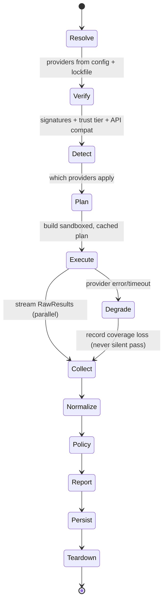

# PROVIDER_ARCHITECTURE.md — ShipReady AI

**Analyzers are interchangeable providers. The core is provider-blind.**

Semgrep, CodeQL, ESLint, Trivy, `tsc`, the native Supabase/RLS checker, and analyzers that don't exist
yet are all *providers* behind one contract. Everything above the provider line — normalization, policy,
scoring, reporting, trends, attestation — reasons only about a **canonical `Finding`** and never about who
produced it. Swapping Semgrep for CodeQL, or adding a Python provider in year 3, must be a configuration
change, not a rewrite.

This document defines: the canonical Finding schema, the provider interface, the normalization pipeline,
the policy engine, the report engine, the plugin lifecycle, the versioning strategy, the compatibility
guarantees, and the extension SDK.

---

## 0. Principles and the core invariant

1. **Provider-blindness (the invariant).** No module above the provider boundary may branch on provider
   identity. Provenance exists for audit/debug only and is *structurally* quarantined (§1.4). Enforced by
   type projection + a dependency-cruiser/lint rule that forbids reading `provenance.*` in
   `policy`, `scoring`, `report`, and `trends`.
2. **The core owns meaning; providers own extraction.** Providers find *raw signals*; the core assigns
   **canonical rule identity, severity, confidence, and policy consequence.** A provider cannot decide
   that something is "Critical" in ShipReady terms — it reports its native signal; the mapping layer
   decides. This is what makes providers interchangeable and keeps the verdict deterministic and ours.
3. **Determinism survives non-deterministic providers.** Some providers are best-effort. The core records
   each provider's determinism guarantee, and the *policy verdict* is computed only from findings whose
   provenance meets the policy's required determinism (best-effort findings can inform, but a policy may
   refuse to *gate* on them). See §5.4.
4. **Coverage is a first-class output, not an assumption.** "No findings" ≠ "safe." The core computes what
   was actually analyzed (language × category × analysis-kind) from provider capabilities, so the policy
   can say "Python: not analyzed" instead of silently passing it. This closes the false-negative gap.
5. **Interchange over adapters.** Prefer **SARIF 2.1.0** as the provider output format (Semgrep, CodeQL,
   ESLint, Trivy already emit it). Non-SARIF providers (`tsc`) get a thin adapter. Minimizes bespoke
   normalization code and rides an industry standard.
6. **Least privilege by capability.** A provider gets exactly the filesystem/network/toolchain access it
   *declares it needs*, sandboxed. Untrusted providers get less. This is the answer to "the scan runs on
   a hostile repo in the customer's CI" and "third-party rules must not be RCE."

**The swap-equivalence boundary (what provider-blindness guarantees — and what it does not).** Given the
*same normalized canonical finding*, provider identity must not change **(a)** the **verdict** (policy
decision + tier + gate reason), **(b)** the **canonical finding fields policy reads** (`rule.id`,
`category`, `severity`, `confidence`, `status`, `fingerprint`), or **(c)** the **policy outcome** for that
finding. It explicitly does **not** guarantee identical: provider metadata/provenance, evidence text or
ordering, data-flow trace shape, secondary locations, report formatting, or the *raw finding set* — a
stronger analyzer may legitimately find more, which changes coverage and corroboration *by design*.
Swap-invariance is a property of the **normalization → policy path over an equivalent finding**, never of
the full report or the finding set. Enforcement/testing: §1.4.

```mermaid
flowchart TD
    subgraph Providers["Provider tier (replaceable, sandboxed)"]
      P1[Semgrep provider] --> R[(Raw output\nSARIF / native)]
      P2[tsc provider] --> R
      P3[Trivy provider] --> R
      P4[Native RLS/SQL provider] --> R
      P5[ESLint / CodeQL / future] --> R
    end
    R --> N[Normalization pipeline]
    N --> CF[(Canonical Findings\n+ Coverage + Provenance)]
    CF --> POL[Policy engine\n(provider-blind)]
    CF --> REP[Report engine\n(provider-blind)]
    POL --> REP
    POL --> ATT[Attestation / trends]
    classDef blind fill:#eef,stroke:#88a;
    class POL,REP,ATT blind;
```

---

## 1. The canonical `Finding` schema

The heart of provider-blindness. Version: `findingSchemaVersion` (semver, §8). Lives in
`@shipready/schema`. SARIF-inspired but opinionated and closed (SARIF is a transport; this is our model).

### 1.1 Type sketch

```ts
interface CanonicalFinding {
  schemaVersion: string;                 // "2.0.0"
  id: string;                            // per-scan unique
  fingerprint: string;                   // STABLE across scans/providers/reformatting (§4.5)

  rule: CanonicalRuleRef;                // canonical identity assigned by normalization (§1.2)
  category: Category;                    // data-exposure | authz | secrets | injection | deps | types | a11y | perf | config | ...
  severity: Severity;                    // critical | high | medium | low | info  (canonical, mapping-assigned)
  confidence: Confidence;                // certain | firm | tentative           (canonical, corroboration-aware)

  message: string;                       // one-line, normalized, human-readable
  locations: CanonicalLocation[];        // primary first; normalized, repo-relative (§4.4)
  dataFlow?: CanonicalFlow;              // optional taint/trace (source→sink), provider-agnostic (§1.3)
  evidence: Evidence;                    // snippet (redacted), structured facts

  status: FindingStatus;                 // open | acknowledged | fixed | wontfix | false_positive
  suppression?: Suppression;             // inline/config/policy waiver, always recorded (never silent)

  corroboration: Corroboration;          // how many independent providers agree (§4.6)
  provenance: Provenance;                // QUARANTINED: audit-only, never read by core logic (§1.4)
}
```

### 1.2 Canonical rule identity

Providers speak native rule IDs (`semgrep: sql-injection`, `eslint: jsx-a11y/alt-text`, `tsc: TS2532`,
`trivy: CVE-2024-1234`). The **catalog** assigns canonical meaning via an ordered list of **mapping rules**
(`predicate → assignment`) — **not** a flat `(provider, nativeRule) → rule` table — because mapping is
many-to-many and context-dependent (one native rule can mean different things by location/metadata; several
native rules can satisfy one canonical rule).

```ts
interface CanonicalRuleRef {
  id: RuleId | SyntheticRuleId;   // "SR-AUTHZ-001"  or  "SR-EXT-semgrep.sql-injection"
  mapped: boolean;                // true = curated canonical rule; false = passthrough
  catalogVersion: string;         // pinned per scan → reproducible
  cwe?: string[];
  owaspAsvs?: string[];
  docsUrl?: string;
}

interface MappingRule {
  // PREDICATE — any subset of clauses; every clause present must match
  when: {
    provider?: string;                  // "semgrep"  (optional — cross-provider mappings allowed)
    nativeRuleId?: string | RegExp;     // "sql-injection" | /^authz-/
    category?: Category;                // provider-declared / SARIF-tagged category
    language?: string;                  // "ts" | "sql"
    metadata?: Record<string, unknown>; // match on SARIF properties / tags (e.g., cwe present)
    minNativeConfidence?: string;       // the provider's own confidence, if given
  };
  // ASSIGNMENT — the catalog OWNS meaning
  assign: {
    ruleId: RuleId;                     // canonical "SR-INJ-001"
    severity: Severity;                 // canonical severity (NOT the provider's)
    baseConfidence: Confidence;         // default confidence before corroboration (§4.9)
    // policy consequence & readiness impact follow from ruleId via the catalog/policy
  };
}
```

- Mapping rules are evaluated **in order; first match wins.** Anything unmatched becomes a passthrough
  `SR-EXT-<provider>.<native>` (`mapped:false`, advisory) so nothing is lost — turn on a whole Semgrep
  ruleset day one, then progressively "adopt" rules into the curated catalog.
- **Mapped rules** (`mapped:true`) are curated: ShipReady owns title, severity, base confidence, weight,
  remediation template, docs page. Multiple native rules may map to one canonical rule (Semgrep *and*
  CodeQL SQLi → `SR-INJ-001`) — the basis for correlation and provider swap.
- **Why this keeps meaning ours, not the vendor's:** the provider's native id/severity/category are only
  *predicate inputs*; every user-facing consequence (canonical rule, severity, base confidence, policy
  impact) is set by the **assignment** in *our* catalog. A provider cannot make something "Critical in
  ShipReady terms," relabel a category, or gain policy weight by changing its own metadata — it can only
  match a predicate whose assignment we control.
- **Schema lock:** the ordered-predicate *shape* is fixed; its *content* evolves freely, so
  context-dependent mappings never require a migration.

The catalog (mapping rules + canonical metadata) is **content, versioned independently** of both engine and
providers (§8), pinned per scan.

### 1.3 Provider-agnostic data-flow

Taint traces from CodeQL/Semgrep must normalize to one shape so the report renders identically regardless
of source:

```ts
interface CanonicalFlow {
  source: CanonicalLocation;             // where tainted data enters
  sink: CanonicalLocation;               // where it causes harm
  steps: CanonicalLocation[];            // ordered intermediate hops
  kind: 'taint' | 'reachability' | 'path';
}
```

Providers without dataflow simply omit it. The report/policy treat `dataFlow` as optional enrichment,
never provider-specific.

### 1.4 The provenance quarantine (how "the core never knows" is enforced)

```ts
interface Provenance {
  sources: FindingSource[];              // ≥1; multiple after correlation
}
interface FindingSource {
  provider: string;                      // "semgrep"  — audit only
  providerVersion: string;
  providerApiVersion: string;
  nativeRuleId: string;
  nativeSeverity?: string;
  determinism: 'deterministic' | 'best-effort';
  raw?: unknown;                         // original SARIF result, for debugging (never rendered by default)
}
```

Enforcement, three layers:
1. **Type projection.** The policy and report engines are typed against `PolicyFinding` /
   `ReportFinding`, which are `Omit<CanonicalFinding, 'provenance'>` plus a `corroborationCount: number`.
   The provider identity is *not in scope* for those modules — you can't branch on what you can't see.
2. **Lint/architecture rule.** dependency-cruiser forbids `policy/**`, `scoring/**`, `report/**`,
   `trends/**` from importing `provenance` types or accessing `.provenance`.
3. **Swap test (unit-level).** The enforceable test injects the *same normalized canonical finding* behind
   two different `provenance` values and asserts an identical **verdict + canonical fields + policy
   outcome** (the equivalence boundary in §0). It runs on **synthetic normalized findings — not on real
   Semgrep-vs-CodeQL output**, because two engines never produce identical raw finding *sets*; report body,
   evidence ordering, data-flow trace shape, and provenance are deliberately out of scope. This validates
   the normalization→policy→report *blindness*, not real-provider equivalence.

---

## 2. The provider interface

A provider is an adapter. It declares capabilities, detects applicability, plans work, runs (sandboxed),
and emits raw results the core normalizes. It never touches the canonical Finding's *meaning*.

### 2.1 Contract

```ts
interface Provider {
  readonly metadata: ProviderMetadata;
  readonly capabilities: Capabilities;

  detect(ctx: DetectContext): Promise<DetectResult>;      // is this provider relevant to this repo?
  plan(ctx: PlanContext): Promise<ExecutionPlan>;         // what files/units, cache keys, cost estimate
  run(ctx: RunContext): AsyncIterable<RawResult>;         // sandboxed; streams raw (SARIF or native)
  teardown?(ctx: RunContext): Promise<void>;
}

interface ProviderMetadata {
  id: string;                            // "semgrep", "tsc", "org.acme.custom"
  version: string;                       // provider semver
  providerApiVersion: string;            // which core contract it implements (§8)
  trustTier: TrustTier;                  // core | first-party | verified | community
  signature?: Signature;                 // required for verified/community (§10.4)
}

interface Capabilities {
  languages: string[];                   // ["ts","tsx","sql"]  (canonical language ids)
  categories: Category[];                // classes it can produce
  analysisKinds: AnalysisKind[];         // ['ast','taint','sca','secrets','type-check','iac','lexical']
  requires: {
    filesystem: 'read';                  // always read-only, repo-scoped
    network: boolean;                    // false unless the provider genuinely needs it (SCA advisory DB)
    build: boolean;                      // needs a toolchain present (tsc)
    toolchain?: string[];                // ["node>=20","semgrep>=1.x"]
  };
  produces: { findings: true; dataFlow: boolean; coverage: boolean };
  determinism: 'deterministic' | 'best-effort';
  incremental: IncrementalCapability;    // extensible invalidation model (§7.4); EXECUTION is Phase 2
  outputFormat: 'sarif-2.1.0' | 'native';
}

// Replaces the naive `incremental: boolean`. The schema is defined NOW so incremental execution can be
// switched on in Phase 2 without a schema change or migration. A provider MUST declare the coarsest
// input change that invalidates a cached unit — this is the correctness guardrail for interprocedural
// (taint/dataflow) analyzers, which must NOT be invalidated at file granularity.
interface IncrementalCapability {
  supported: boolean;                    // can run on a subset of units (Phase 2 execution)
  unit: 'file' | 'directory' | 'package' | 'program';   // granularity it caches / invalidates at
  invalidatesOn: InvalidationTrigger[];  // input changes that force re-analysis of a unit
}
type InvalidationTrigger =
  | 'file-content'        // a file in the unit changed              (file-local: a11y, style)
  | 'directory-content'   // any file in the unit's dir/module changed (interprocedural taint)
  | 'dependency-graph'    // lockfile / import graph changed          (SCA, cross-package taint)
  | 'configuration'       // repo/provider config changed
  | 'ruleset'             // the provider's active rules / pack version changed
  | 'toolchain';          // compiler/runtime version changed         (e.g., tsc)

interface RawResult {
  format: 'sarif-2.1.0' | 'native';
  payload: unknown;                      // SARIF run, or provider-native object the adapter also maps
  // If native, the adapter MUST also provide a normalizer descriptor or map() itself (§4.2).
}
```

### 2.2 What a provider must NOT do

- Must not assign ShipReady canonical severity/confidence/rule identity (it may *suggest* a native
  severity; the core maps).
- Must not write outside its sandbox, open undeclared network, or execute repo lifecycle scripts
  (never `npm install`).
- Must not depend on wall-clock/random in a way that changes findings if it declares `deterministic`.
- Must not retain or transmit source. (Community providers are additionally network-denied by default.)

### 2.3 Two kinds of providers (important distinction)

| Kind | Brings | Example | Distribution |
|---|---|---|---|
| **Analyzer provider** | an engine/binary/library | Semgrep, CodeQL, tsc, Trivy, native RLS checker | npm/OCI package + adapter |
| **Rule pack** | *content* that runs on an analyzer provider | "ShipReady Supabase rules" (Semgrep patterns), an org's custom rules | signed data package (§10.5) |

Rule packs never ship executable logic that runs in the user's repo — they are **declarative patterns**
interpreted by an analyzer provider. This is the only safe basis for a third-party ecosystem (imperative
third-party rules = RCE distribution; forbidden).

---

## 3. Provider taxonomy, trust tiers, and sandboxing

### 3.1 Trust tiers

| Tier | Who | Sandbox | Network | Can gate policy? |
|---|---|---|---|---|
| **core** | bundled (native RLS/SQL, deps) | in-process, restricted | no | yes |
| **first-party** | ShipReady-authored adapters (Semgrep, tsc, Trivy) | subprocess, resource-limited | only if capability declared + user-approved | yes |
| **verified** | third-party, signed + passed conformance (§10.3) | subprocess, strict | denied by default | yes (if policy opts in) |
| **community** | unsigned/unreviewed | subprocess, strictest, network-denied, read-only | no | advisory-only by default |

### 3.2 Sandbox model

- Every non-core provider runs as a **subprocess** with: read-only bind of the repo, a private temp dir,
  CPU/memory/time limits, no ambient env, and **network denied unless declared+granted**. On CI/enterprise
  this can escalate to a container/microVM.
- IPC is a **stable JSON protocol over stdio** (or SARIF file handoff): `plan`/`run` requests, streamed
  `RawResult`, structured errors, heartbeat. The core kills a provider that exceeds budget → recorded as a
  `providerError` + coverage loss, never a silent pass.
- This directly mitigates the review's top under-modeled boundary (scanning hostile repos) and makes the
  ecosystem safe.

---

## 4. The normalization pipeline

Raw provider output → validated, mapped, correlated, redacted canonical Findings + a coverage report. Pure
and deterministic given (raw outputs, catalog version, policy-independent config).

```mermaid
flowchart LR
    A[Raw results\nper provider] --> B[Ingest + schema-validate\n(SARIF/native)]
    B --> C[Adapter map →\ncanonical shape]
    C --> D[Rule identity resolution\n(catalog mapping)]
    D --> E[Location normalization]
    E --> F[Severity/confidence\nmapping]
    F --> G[Redaction\n(secret masking)]
    G --> H[Fingerprinting]
    H --> I[Dedup + cross-provider\ncorrelation]
    I --> J[Suppression application]
    J --> K[Coverage computation]
    K --> L[(Canonical Findings\n+ Coverage + Provenance)]
```

### 4.1 Ingest & validate
Parse SARIF 2.1.0 (or native), validate against a strict schema, reject malformed with a `providerError`.
Untrusted payloads are treated as hostile (size caps, no code execution, XSS-safe handling of messages).

### 4.2 Adapter mapping
SARIF providers map through one shared SARIF→canonical mapper. Native providers ship a `map()` that emits
canonical-shape findings (still validated by the core). The adapter is the *only* provider-specific code;
everything downstream is generic.

### 4.3 Rule identity resolution
Evaluate the catalog's ordered **mapping rules** (§1.2) against the finding's `(provider, nativeRuleId,
category, language, metadata, nativeConfidence)`; the **first matching rule's assignment** sets canonical
`rule.id`, `severity`, and `baseConfidence` (`mapped:true`). No match → synthesize
`SR-EXT-<provider>.<native>` (`mapped:false`, advisory). Attach CWE/ASVS/docs from the catalog. Unmatched
native rules seen often across scans are logged as curation candidates.

### 4.4 Location normalization
Repo-relative POSIX paths; canonical 1-based line/col ranges; collapse provider quirks (0- vs 1-based,
byte vs char offsets); attach a logical location (enclosing symbol) where the provider gives it. This is
what makes fingerprints stable and cross-provider correlation possible.

### 4.5 Fingerprinting (stability contract)
`fingerprint = hash(canonicalRuleId, repoRelPath, enclosingSymbol?, normalizedContextHash)` —
deliberately **excludes raw line numbers** so a finding survives reformatting/line shifts, and **excludes
provider identity** so the *same issue found by a different provider gets the same fingerprint*. Enables:
trend tracking ("is this fixed?"), dedup, and correlation. This is the linchpin of provider
interchangeability at the data level.

### 4.6 Deduplication & cross-provider correlation (v1 strategy)
Correlation is a **matching problem, not hash equality** — two engines routinely report the same issue at
different anchor points (Semgrep at the sink call, CodeQL at the source; a taint finding spans
source→sink). v1 aims for a **safe, conservative** correlation, not a perfect one.

**Merge criteria (ALL must hold):**
1. **Canonical rule identity:** both findings resolved to the *same mapped* canonical `rule.id` (§1.2).
   Unmapped `SR-EXT-*` findings **never** merge across providers (no shared meaning to corroborate).
2. **Location overlap:** primary `CanonicalLocation` ranges **overlap** after normalization (§4.4); **or**,
   for flow findings, their **sink** locations overlap (sink identity, below).
3. **Same enclosing scope:** same `repoRelPath` and, when both provide it, the same enclosing symbol.

**Sink identity (flow findings):** when `dataFlow` is present, correlation keys on the **sink** location +
canonical rule — the sink is the stable, harm-defining anchor across engines. Sources/steps may differ and
are retained per-source as evidence, never used as the match key.

**Normalization rules feeding correlation:** repo-relative POSIX paths, 1-based ranges, byte→char offset
normalization, enclosing-symbol resolution (§4.4). Correlation runs *after* normalization so provider
quirks cannot cause spurious non-matches.

**Merged fingerprint construction:** a merged finding adopts a **canonical merged fingerprint** =
`hash(canonicalRuleId, repoRelPath, enclosingSymbol?, normalizedPrimaryOrSinkLocationHash)` —
provider-independent (§4.5), so the merged finding is itself stable across scans *regardless of which
providers happened to report it*.

**Merge result:** one `CanonicalFinding` with multiple `provenance.sources`; canonical fields (rule,
category, severity) come from the catalog and are identical by construction; `confidence` is adjusted by
corroboration (§4.9); each source's evidence is retained and ordered deterministically.

**Non-merge criteria (kept separate):** different canonical rule; non-overlapping locations; any unmapped
finding; a mapped vs. unmapped pair; different enclosing scopes. **When in doubt, do not merge** —
under-merging is the safe failure.

**Expected under-merging (accepted in v1):** two engines flag the same conceptual bug at genuinely
different, non-overlapping locations (one at the route handler, one at the DB call) → they stay two
findings and corroboration is *not* credited. We **under-count corroboration, never over-credit** it; a
lone finding simply keeps its base confidence and is judged on its own merits — the safe direction.

**Expected over-merging (bounded):** two *distinct* same-rule bugs at overlapping ranges in one symbol may
merge into one finding. Bounded by requiring rule + overlap + scope; the risk is losing a duplicate, not
hiding a *class* (the merged finding still reports the issue and all evidence). If a provider supplies a
stable sub-key (SARIF `partialFingerprints` / logical location), it is added to the match to split them.

**Tunable thresholds (config; defaults conservative; recorded per scan for reproducibility):**
`locationOverlap` (`exact` | `range-overlap` | `same-line`; default `range-overlap`),
`requireEnclosingSymbol` (default `true` when available), `flowMatch` (`sink` | `source-and-sink`;
default `sink`).

### 4.7 Redaction
Secret-marked evidence is masked here (belt-and-suspenders with provider + CLI redaction). No raw secret
survives into the canonical set.

### 4.8 Coverage computation (effective, not declared)
Coverage is the **intersection of declared capability AND rules that actually executed successfully** —
never a provider's bare claim. A provider that *declares* the `authz` category but ran with a ruleset
containing **zero authz rules** contributes **no** authz coverage. Per `(language × category ×
analysisKind)` cell:
- start from each executed provider's *declared* capability for the cell;
- **require ≥1 rule for that cell to have actually executed** — the provider reports executed-rule
  counts/ids per category in its run summary; a cell with zero executed rules is **not** covered by that
  provider;
- subtract cells lost to `providerError`/timeout (recorded as `degraded`).

Result per cell: `{ covered: boolean; byProviders[]; executedRuleCount; degraded? }`. This is what lets a
policy distinguish **PASS** (required cells *effectively* covered **and** clean) from
**INSUFFICIENT_COVERAGE** (a required cell had no effective coverage). **Lack of evidence can never become
PASS** — a required cell with no executed rules yields `insufficient_coverage`, not `pass` (§5.4).

### 4.9 Corroboration → confidence, but severity gates
Three orthogonal signals travel on every canonical finding, with **fixed roles** so that adding or removing
a provider cannot silently flip a gate:

- **Severity** — catalog-assigned "how bad if true." **This gates by default.** It never changes with the
  provider set.
- **Confidence** — "how sure it's true." Starts at the rule's `baseConfidence` and is **raised by
  corroboration** (independent providers agreeing). Primarily a *display* and *prioritization* signal.
- **Corroboration** — `{ count, independentProviders }`, a provider-blind integer (names never exposed).

**Gating rule (default policy):** controls key on **base severity + status** (e.g., "no open data-exposure
finding at High/Critical"), *not* on corroboration-boosted confidence. So removing one of two corroborating
providers does **not** flip a Critical from gated to un-gated. A policy **may** additionally require a
minimum corroboration count or confidence for a *specific* control (to dampen noise on a heuristic
category), but that is an explicit, opt-in tightening — never the implicit default, and never provider
names.

**What the policy sees, and why:** the policy engine reads `severity`, `status`, `confidence`, and
`corroborationCount` from `PolicyFinding` — **never provider identity**. Gating on `severity` keeps the
verdict a function of the finding's *intrinsic* risk; `confidence`/`corroborationCount` are available only
for opt-in tightening. The verdict therefore remains a function of `(canonical findings, coverage, policy)`;
the provider set influences only *how much* corroboration/coverage exists — which a coverage-aware,
severity-gated policy handles explicitly rather than by accident. Provider-blindness is fully preserved.

---

## 5. The policy engine

Policy-as-code over `PolicyFinding[]` + coverage. Deterministic. **Policy is the primary abstraction; the
0–100 score is one optional policy output** (per the architecture review's recommendation). Provider-blind.

### 5.1 Policy profile (declarative)

```yaml
# shipready.policy.yaml   (versioned content, pinned per scan)
apiVersion: shipready.dev/policy/v1
version: "2026.08.0"
name: "Default — AI app readiness"

requiredCoverage:                 # coverage-aware gating (§5.4)
  - language: ts
    categories: [authz, data-exposure, secrets, injection]
    minAnalysisKind: taint        # a lexical-only provider does NOT satisfy this
  - language: sql
    categories: [data-exposure]

controls:                         # named, auditable requirements
  - id: NO-DATA-EXPOSURE
    description: "No open data-exposure finding at High or Critical severity"
    match: { category: data-exposure, status: open, minSeverity: high }  # SEVERITY gates by default (§4.9)
    forbid: any                   # any match → control fails
    onlyDeterministic: true       # ignore best-effort provenance for gating (§0.3)
    # optional tightening (opt-in, never the default): dampen heuristic noise via corroboration
    # requireCorroboration: 2
  - id: NO-COMMITTED-SECRETS
    match: { category: secrets, status: open }
    forbid: any
  - id: TYPES-COMPILE
    match: { rule: SR-TS-002, status: open }
    forbid: any

gate:                             # the pass/fail verdict
  fail_if:
    - control_failed: [NO-DATA-EXPOSURE, NO-COMMITTED-SECRETS, TYPES-COMPILE]
    - coverage_insufficient: true
  at_risk_if:
    - open: { severity: high, status: open }   # severity-driven (§4.9); not corroboration-dependent

scoring:                          # OPTIONAL diagnostic (not the verdict)
  enabled: true
  profile: default                # weights/severity-points from SCORING.md, catalog-versioned
  overrides:                      # enterprises tune here, explicitly
    weights: { authz: 20, data-exposure: 20 }

severityOverrides:                # org can re-rank a canonical rule
  - rule: SR-A11Y-001
    severity: info

waivers:                          # exceptions, expiring, justified, audited
  - fingerprint: fp_abc123
    reason: "Vendored fixture; not shipped"
    approvedBy: "u_123"
    expires: "2026-12-31"
```

### 5.2 Evaluation

```ts
function evaluatePolicy(findings: PolicyFinding[], coverage: Coverage, policy: Policy): PolicyResult
```

Deterministic pass over controls → gate → optional score. Output:

```ts
interface PolicyResult {
  decision: 'pass' | 'fail' | 'insufficient_coverage';
  tier: 'ready' | 'at_risk' | 'blocked';
  controls: { id: string; passed: boolean; matched: Fingerprint[] }[];
  gateReason?: string;                    // which control/coverage forced it
  score?: { value: number; breakdown: CategoryBreakdown };  // diagnostic only
  coverage: CoverageReport;               // what was / wasn't analyzed
  waived: WaivedFinding[];                // shown, never silent
  policyVersion: string; catalogVersion: string;
}
```

### 5.3 Scoring as a policy output
The 0–100 lives here as an *optional profile*, not a universal truth. Default profile = SCORING.md math.
Enterprises can disable it entirely and gate purely on controls. This resolves the review's "scores get
gamed/disputed" finding: the **gate is binary and named**; the number is a private diagnostic/trend.

### 5.4 Coverage-aware verdicts (the false-negative fix)
If `requiredCoverage` isn't met (e.g., policy requires `taint` for TS authz but only a lexical provider
ran, or Python code exists with no Python provider), the decision is **`insufficient_coverage`**, not
`pass`. "We couldn't verify" is never rendered as "safe." Best-effort provenance can be excluded from
gating via `onlyDeterministic`.

### 5.5 Provider-blindness in policy
`PolicyFinding` has no provider field. Default gating keys on **severity** (§4.9); a policy may *optionally*
require an *analysis kind*, a *minimum confidence*, or a *corroboration count* ("gate only on findings
corroborated by ≥1 deterministic provider"), never a vendor name. So a policy written today keeps working
when the underlying analyzer is swapped.

---

## 6. The report engine

Consumes `ReportFinding[]` + `PolicyResult` only. **Provider-blind in structure:** given the *same
canonical finding set + PolicyResult*, the report body is byte-stable and provenance appears solely in a
collapsible "Analysis sources" appendix. It is **not** claimed that different provider sets yield identical
reports — richer providers change the finding set, coverage, and corroboration, and the report faithfully
reflects that. The swap guarantee is at the verdict/canonical-field level (§0), not the whole report.

- **Executive summary:** tier + gate reason + top risks + **coverage statement** ("Analyzed: TS, SQL via
  taint+AST; Not analyzed: none") + delta.
- **Findings:** grouped by canonical category/severity; each shows canonical rule, evidence, optional
  data-flow trace (rendered through one provider-agnostic component; the trace *content* may differ by
  provider), corroboration badge ("confirmed by 2 analyzers"), remediation (deterministic template +
  optional AI enrichment).
- **Coverage report:** explicit matrix — the anti-false-confidence surface.
- **Appendix (debug only):** provenance, provider versions, raw SARIF links. The *only* place provider
  identity is shown, and it drives nothing.
- **PDF/JSON** are the same ViewModel (REPORT_ENGINE.md). Byte-stable given
  `(findings, policyResult, catalogVersion)`.

---

## 7. Plugin lifecycle



### 7.1 Resolve
Providers + versions come from `shipready.config.ts` and a committed **provider lockfile**
(`shipready.providers.lock`) — reproducible provider sets, exactly like a package lockfile.

### 7.2 Verify
Check signatures (verified/community), enforce trust-tier sandbox, and check **provider API compatibility**
(§8): the provider's `providerApiVersion` must be in the core's supported range, else load a shim or skip
with a clear diagnostic.

### 7.3 Detect & Plan
`detect()` gates applicability (no Trivy work if no lockfile; no SQL provider if no `.sql`). `plan()`
returns the file/unit set + cache keys + cost estimate; the core **deduplicates work across providers**
(one file walk, shared) and schedules parallel, budgeted execution.

### 7.4 Execute — caching & incremental (invalidation-correct; execution is Phase 2)
- Each cached **unit** result is keyed by
  `hash(providerVersion, ruleSetVersion, config, toolchain, unitInputHash)`, where `unitInputHash` covers
  **every input the provider's `incremental.invalidatesOn` declares** — not just the changed file. A
  provider whose `unit` is `package`/`program` with `invalidatesOn: ['directory-content','dependency-graph']`
  re-analyzes the whole unit if *any* member or dependency changed. **This is the correctness guardrail
  against stale interprocedural (taint/dataflow) findings** — file-level invalidation must never be applied
  to a provider that reasons across files. A local content-addressed store (`.shipready/cache`) persists
  unit results.
- **Incremental EXECUTION is Phase 2.** V1 runs full, cache-keyed scans (the V1 ICP is small AI-app repos,
  where full scans are fast). The *capability schema and cache keys are defined now* (§2.1) so incremental
  can be turned on later **without a schema change or migration**.
- Providers with `incremental.supported = false` run full each scan but are still cache-keyed by unit hash.

### 7.5 Degrade
A provider crash/timeout/violation → `providerError` + coverage subtraction + surfaced in the report.
The scan is never silently partial.

---

## 8. Versioning strategy

Six independently versioned artifacts, each with a clear owner and pinning:

| Artifact | Version field | Semver rule | Pinned per scan? |
|---|---|---|---|
| **Finding schema** | `findingSchemaVersion` | additive=minor, breaking=major; core supports current + prior major | yes (in ScanResult) |
| **Provider API** | `providerApiVersion` | the Provider contract; additive=minor, breaking=major; core supports a *range* | recorded per provider |
| **Provider** | provider `version` | provider's own semver | recorded per provider |
| **Catalog / rule-mapping** | `catalogVersion` | add rule/mapping=minor; reweight/severity/remove=major | yes |
| **Policy profile** | policy `version` | content semver; changing a control/threshold=major | yes |
| **Engine (core)** | `engineVersion` | core semver | yes |

Rules:
- **The ScanResult records all six.** Any scan is fully reproducible and reconcilable across time.
- **Additive-only within a major.** New optional fields; consumers ignore unknown fields (forward-compat).
- **Provider API is a range contract:** core `1.x` accepts providers targeting `1.0`–`1.x`; a provider
  targeting `1.5` degrades gracefully on core `1.3` (unknown capabilities ignored) or is rejected with a
  clear message if it needs a capability the core lacks.
- **Catalog/policy are content, shipped and pinned independently of engine releases** — you can improve
  rules or tighten a policy without an engine deploy, and old scans still evaluate under their pinned
  versions.

---

## 9. Compatibility guarantees

### 9.1 Compatibility matrix (published)
A living matrix maps `engineVersion` → supported `findingSchemaVersion` majors and `providerApiVersion`
range. CI verifies every first-party provider against the matrix.

### 9.2 Semver contract
- **Backward compatible (minor/patch):** add optional schema fields, add capabilities, add categories/
  analysis-kinds, add catalog rules/mappings. Existing providers, policies, and stored scans keep working.
- **Breaking (major):** remove/rename a schema field, change a field's meaning, remove a capability the
  core relied on, change gate semantics. Requires a major bump + migration.

### 9.3 Forward compatibility
Unknown fields are preserved and ignored, not rejected. A newer provider talking to an older core, or an
older stored scan read by a newer core, both work within a major. The server **ingests older engine/
provider/catalog output and reconciles** (unknown canonical rules → advisory; missing coverage →
conservative).

### 9.4 Deprecation policy
- Deprecations are announced with a **support window (≥2 minor releases / ≥6 months)**, emit runtime
  warnings, and are listed in a `DEPRECATIONS.md`.
- A canonical rule is never *deleted*; it's marked `deprecated` in the catalog (its ID is never reused) so
  historical findings/trends stay intelligible.
- Provider API majors ship with a **compatibility shim** for the prior major for one release cycle.

### 9.5 Stability tiers of the surface
`stable` (schema, provider API, `/v1` API — full guarantees) · `beta` (new capabilities — may change with
notice) · `experimental` (opt-in, no guarantees). Everything ships labeled.

---

## 10. Extension SDK

`@shipready/provider-sdk` — everything needed to build, test, sign, and publish a provider or rule pack
*without touching the core*.

### 10.1 What it ships
- **Types & contract:** `Provider`, `Capabilities`, `RawResult`, canonical schema, SARIF helpers.
- **Normalization helpers:** SARIF→canonical mapper, location normalizer, mapping-descriptor builder, so
  most SARIF providers are ~100 lines.
- **Scaffolding CLI:** `shipready provider init` / `shipready rulepack init` → a working skeleton +
  fixtures + conformance harness.
- **Local runner:** run your provider inside the real sandbox + normalization + a sample policy, offline.
- **Signing & provenance tooling** (§10.4).

### 10.2 Authoring a provider (shape)
```ts
export default defineProvider({
  metadata: { id: 'org.acme.gosec', version: '0.1.0', providerApiVersion: '1.0', trustTier: 'community' },
  capabilities: {
    languages: ['go'], categories: ['injection','secrets'], analysisKinds: ['ast','taint'],
    requires: { filesystem: 'read', network: false, build: false }, outputFormat: 'sarif-2.1.0',
    produces: { findings: true, dataFlow: true, coverage: true },
    determinism: 'deterministic', incremental: true,
  },
  detect: async (ctx) => ({ applies: ctx.hasLanguage('go') }),
  plan:   async (ctx) => ctx.planByPackage(),
  run:    async function* (ctx) { yield { format: 'sarif-2.1.0', payload: await runGosec(ctx.unit) }; },
});
```

### 10.3 Conformance suite (the gate to "verified")
A provider must pass to be listed/verified:
- **Schema conformance:** all emitted findings validate; SARIF parsed correctly.
- **Determinism:** two runs on the same fixture → identical canonical findings (if it claims
  `deterministic`).
- **Sandbox honesty:** no undeclared network/filesystem access (enforced + tested by denying them).
- **Redaction:** never emits an unmasked secret from the secret-fixture repo.
- **Provider-blindness:** the reference policy/report produce identical verdicts when this provider stands
  in for a baseline provider on equivalent findings.
- **Teardown:** no leaked processes/temp files.
- **Coverage honesty:** declared capabilities match what it actually analyzes on the corpus.

### 10.4 Signing, trust, provenance
Verified/community providers are **signed**; the core verifies the signature + records provenance
(npm provenance / sigstore-style). Trust tier gates sandbox + gating rights (§3). Community defaults to
network-denied, advisory-only.

### 10.5 Rule packs
Declarative content for an analyzer provider (e.g., Semgrep patterns) + a **catalog-mapping fragment**
(native rule → canonical `SR-*`, severity, weight, remediation, docs) + fixtures. Signed, versioned,
pinned. This is how orgs publish internal rules and how the "OWASP-for-AI-apps" community ruleset grows —
**no executable third-party logic ever runs in the user's repo.**

### 10.6 Registry & governance
A signed registry lists providers/rule packs with capabilities, trust tier, conformance status, and
version compatibility. Governance (CONTRIBUTING/GOVERNANCE docs) defines review, signing, and revocation
(a compromised provider/pack can be revoked; the core checks a revocation list).

---

## 11. End-to-end example

Repo: Next.js + Supabase monorepo (pnpm workspaces).

1. **Resolve/verify:** core, native RLS/SQL (core), Semgrep (first-party, ruleset = ShipReady Supabase
   pack + curated authz pack), tsc (first-party), Trivy (first-party, SCA — network capability granted).
2. **Detect/plan:** Trivy applies (lockfile present); native SQL applies (`supabase/migrations`); Semgrep
   + tsc apply (TS). One shared file walk; per-package units; cache checked.
3. **Execute (sandboxed; full + cache-keyed in V1, incremental in Phase 2):** Semgrep emits SARIF taint
   traces for an authz bug; native SQL finds a `USING (true)` policy; tsc fails compile; Trivy finds a CVE.
4. **Normalize:** Semgrep's `authz-missing-check` and a native heuristic both map to `SR-AUTHZ-001` at the
   same fingerprint → **merged, corroboration=2 → confidence firm**. `USING(true)` → `SR-RLS-002`. tsc
   non-zero → `SR-TS-002`. CVE → `SR-DEP-003`. Coverage matrix: TS(authz/injection via taint) ✓,
   SQL(data-exposure) ✓, deps ✓.
5. **Policy:** `NO-DATA-EXPOSURE` fails (`SR-RLS-002` firm) and `TYPES-COMPILE` fails → **gate = blocked**;
   required coverage satisfied (so not `insufficient`); diagnostic score computed.
6. **Report:** for this *equivalent* finding, verdict and canonical fields are identical whether it came
   from Semgrep or (next year) CodeQL; only the provenance appendix differs. A stronger provider that found
   an *additional* issue would legitimately change the finding set (coverage/corroboration shift, by design
   — §0).

Swap Semgrep→CodeQL: change one line in the provider lockfile — no core, policy, or scoring code changes.
The **verdict and canonical fields for an equivalent finding are unchanged** (§0 boundary); the report may
differ where CodeQL finds more. **That is the whole point.**

---

## 12. Traceability to the architecture review

| Review finding | Addressed by |
|---|---|
| B0-1 build-your-own engine is wrong | Providers are interchangeable; Semgrep/CodeQL are adapters; core value = normalization+policy+report |
| B0-2 attestation/tamper | Provider lockfile + pinned versions + reproducible ScanResult hash feed the trusted-runner attestation (separate doc); coverage prevents omission-passes |
| B0-3 static-only ceiling / false negatives | **Coverage-aware policy** (`insufficient_coverage`), dynamic verifier is just another provider/capability |
| Imperative rules = RCE | Rule packs are declarative + signed + sandboxed; only analyzer adapters run code, under trust tiers |
| No incremental/monorepo | §7.4 invalidation-correct cache + per-unit planning defined now; incremental *execution* is Phase 2 (schema ready, no migration) |
| Weak measurement | Conformance suite + corroboration + coverage make quality measurable and providers comparable |
| Scores gamed/disputed | Policy-as-code is primary; score demoted to an optional, override-able diagnostic profile |
| 5-year language expansion | New language = new provider; core is language-agnostic by construction |
